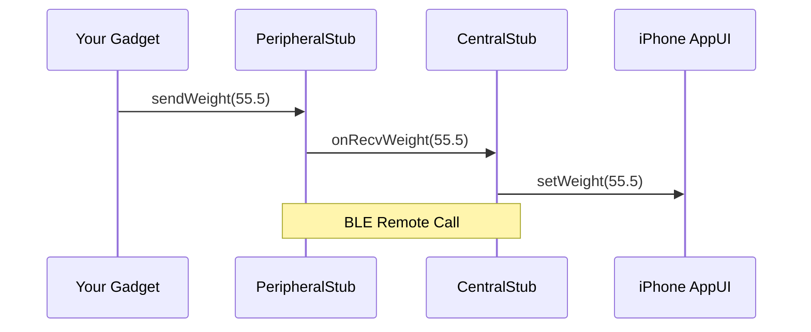

# BlueJinja - BLE Stub code generator

BlueJinjaは、GATT設計値からBLE(Bluetooth Low Energy)の通信スタブコードを生成するコードジェネレータです。

## 概要
GATT設計値を定義ファイルに入力するだけで、スタブコードがCentralとPeripheralのペアで生成されます。
特徴として、リモート関数呼び出し (RPCの簡易実装) に特化したコード生成を行います。



現在生成可能なコードの一覧は以下の通りです。

### Central
- GATT Client
  - for iOS Swift

### Peripheral
- GATT Server
  - for Arduino ESP32 C++

## QuickStart
Service および Characteristic 情報を、gatt.py の Dictionary に入力します。入力後、main.py を実行すると、スタブコードが自動生成されます。

デフォルトで[ExiFlex](https://github.com/2525mura/ExiFlex)のGATT仕様がセットされております。

### Install
```terminal
$ git clone https://github.com/2525mura/blue-jinja.git
$ pip install -r requirements.txt
```

### generate code
```terminal
$ python main.py
```

## GATT 仕様の入力

### Service 仕様の入力
- service 
  - name: Service 名を文字列で入力
  - uuid: Service UUID を入力

### Characteristics 仕様の入力
Characteristics は配列形式で入力します。
- characteristics
  - 配列要素 1
    - name: Characteristics 名を文字列で入力
    - uuid: Characteristics UUID を入力
    - direction: スタブ関数呼び出しの方向を設定、表1参照
    - args
      - type: 引数の型を指定 (Enumから選択)
      - size: 引数のバイト数(1 個あたり)を指定
      - names: 引数名をリストで指定
  - 配列要素 2 ・・・

表1 スタブ関数呼び出し方向

| 設定値  | 動作                                   |
|------|--------------------------------------|
| PtoC | Peripheral から Central への call 関数を作成  |
| CtoP | Central から Peripheral への call 関数を作成  |
| BIDI | Central / Peripheral 両方向の call 関数を作成 |

> **Note**
> 仕様上、複数 Service をまとめてコード生成することはできません。複数 Service ある場合は、1 Service ずつ作成してください。
